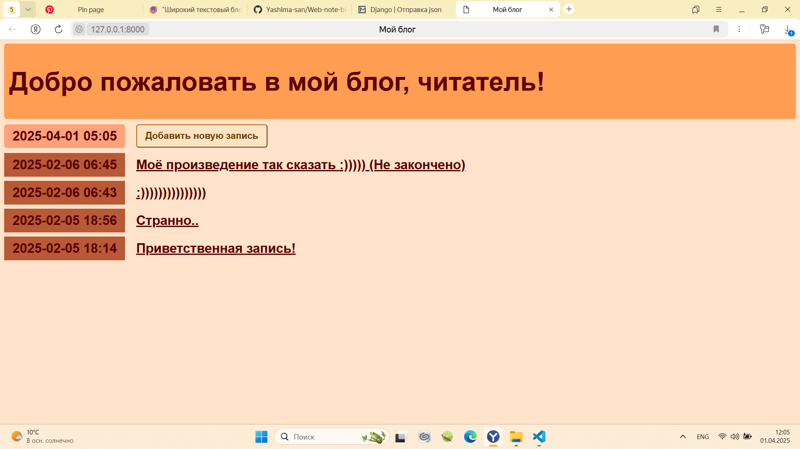

<h1>Пишем приложение на Django. Часть 1.</h1>
<a href="https://skillbox.ru/media/code/pishem-prilozhenie-na-django-chast-1-ustanavlivaem-freymvork-nastraivaem-dvizhok-i-zapisi/">Ссылка на статью</a>
<h3>Здесь мы занимались:</h3>
<ui>
  <li>Устанавливанием фреймворка;</li>
  <li>Настраивали движок;</li>
  <li>Настраивали записи</li>
</ui>
<h1>Пишем приложение на Django. Часть 2.</h1>
<a href="https://skillbox.ru/media/code/pishem-prilozhenie-na-django-chast-2-rabotaem-nad-frontendom-i-adminkoy/?utm_source=media&utm_medium=link&utm_campaign=all_all_media_links_links_articles_all_all_skillbox">Ссылка на статью</a>
<h3>Здесь мы занимались:</h3>
<ui>
  <li>Работаем над фронтендом;</li>
  <li>Работаем над админкой</li>
</ui>
<h3>В результате получается:</h3>
Главная страница</img>
Страница с открытой записью</img>
Страница создания записи</img>
Страница с удалением записи</img>

  
<h1>Metanit - 1 глава. Введение в Django.</h1>
<a href="https://metanit.com/python/django/
1.1.php">Ссылка на Metanit. Глава 1.</a>
<ui>
  <li>Что такое Django - Пройдено</li>
  <li>Установка и настройка Django - Пройдено</li>
  <li>Создание первого проекта - Пройдено</li>
  <li>Создание первого приложения - Пройдено</li>
</ui>
<h3>В результате получается:</h3>
</img>
<h1>Metanit - 2 глава. Представления и маршрутизация.</h1>
<a href="https://metanit.com/python/django/
3.1.php">Ссылка на Metanit. Глава 2.</a>
<ui>
  <li>Обработка запроса - Пройдено</li>
  <li>Определение маршрутов и функции path и re_path - Пройдено</li>
  <li>Получение данных запроса. HttpRequest - Пройдено</li>
  <li>HttpResponse и отправка ответа - Пройдено</li>
  <li>Параметры представлений - Пройдено</li>
  <li>Вложенные маршруты и функция include - Пройдено</li>
  <li>Параметры строки запроса - Пройдено</li>
  <li>Переадресация и отправка статусных кодов - Пройдено</li>
  <li>Отправка json - Пройдено</li>
  <li>Отправка и получение кук- Пройдено</li>
</ui>
<h3>В результате выполнения последнего задания получается:</h3>
</img>